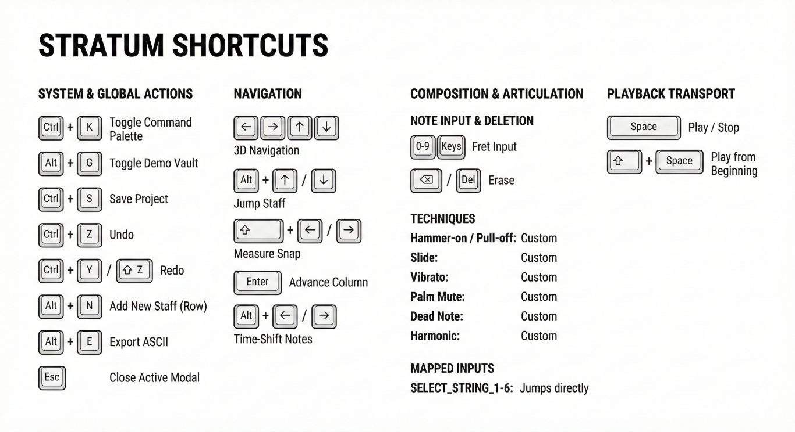

Stratum 🎸

A keyboard-driven, web-based guitar tab editor built for speed.

[Live Demo](https://stratum-guitar-tab-editor.vercel.app/) 

About The Project

Stratum is a solo, open-source project I built because I was frustrated with existing web-based tab editors. Most of them rely heavily on "click-and-place" interfaces, which feel slow when you just want to get an idea down.

I wanted an editor that felt closer to coding or playing an instrument, where your hands stay on the keyboard and you can flow through a composition.

It's built with React 18, TypeScript, and Vite, focusing on performance and a strict grid layout to keep even complex scores organized.
Key Features

    Keyboard-First Design: Almost every action, from navigation to composition, can be done without the mouse. It has a "vim-like" feel tailored for guitar players.

    Fixed Grid Layout: A structured 32-column grid ensures your timing and layout remain consistent across multiple staves.

    ASCII Import/Export: I built a custom parsing engine to import "messy" old text tabs found around the internet and standardize them into the modern grid.

    Audio Playback: Built-in physics-based audio engine using Tone.js for immediate playback of your tab, including techniques like harmonics and palm mutes.

Technical Challenges I Solved

This project presented some interesting engineering hurdles. Here are a few:

1. Handling Fast Fret Typing (The "Double-Digit" Problem)

Standard guitar frets go up to 24. If you type '1' and quickly type '2', a naive system might overwrite the '1' with a '2'.
Solution: I implemented a temporal buffer in the state management. The engine checks the current cell; if it's a single digit and the next input creates a valid fret (≤24), it combines them into '12'. This allows for natural, fast typing without needing a "confirm" key.

2. Cleaning up "Dirty" ASCII Tabs

Text tabs from the 90s are notoriously inconsistent in formatting.
Solution: I developed a "Universal Wash Engine." Instead of relying on rigid character counting, it calculates the relative percentage position of a note within a text string and snaps it to the nearest rhythmic slot in Stratum's 32-column grid.

3. Managing Complex State (Undo/Redo)

Ensuring that complex actions, like time-shifting notes across bars or toggling techniques, didn't corrupt the document history.
Solution: I implemented a robust state management system using React Context and a comprehensive testing suite (Vitest + JSDOM) to verify that the history stack remains synchronized during high-speed editing.
⌨️ Shortcuts Cheat Sheet

Stratum is designed for power users. You can view these at any time in the app by pressing Ctrl + K to open the Command Palette.

